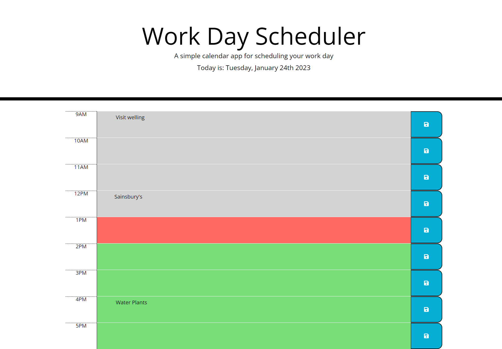

# Calendar Application

## Description
This is a simple digital calendar application that allows a uses to save events or block off time during working hours 9am to 5pm. It is colour coded so user will know events that have passed, events that are present or events happening in the future. This application was design/built using HTML, CSS, jQuery and Moment.js. The starter HTML documents were provided all with CSS style sheet. Additions had to be made to the HTML sheet were the timeblocks. No change was made to the CSS. The script.js file had to be created and all codes wriiten from previously learning. 

## Installation
N/A

## Usage
I enjoyed writing code for this application manageable. Also, I enjoyed making use of this application to keep track of my day. My itentions are to create an academic year planner. This allpication gives good practise of jQuery and consolidates past learning/topics in HTML, CSS Bootstrap and Javascript.

## Credits
I found this website useful.
https://www.geeksforgeeks.org/moment-js-moment-duration-clone-method/

## License

Please refer to repo.

## Link to deployed application

https://jenieb3.github.io/calendar-application/

## Screenshot
